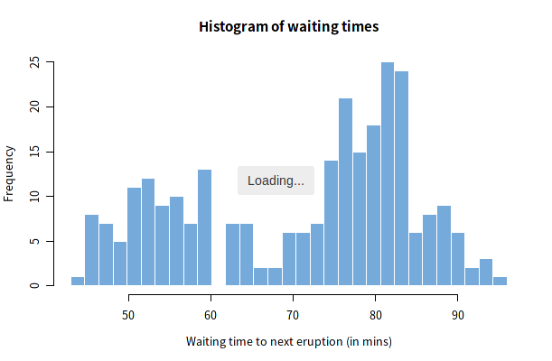

# shinyloadermessage

<!-- badges: start -->
<!-- badges: end -->

Add loader messages to Shiny Outputs.



## Installation

You can install shinyloadermessage from github with:

``` r
# install.packages("remotes")
remotes::install_github("igjit/shinyloadermessage")
```

## Usage

Same as [shinycssloaders](https://github.com/andrewsali/shinycssloaders).

``` r
library(shinyloadermessage)

# ...

withLoaderMessage(plotOutput("distPlot"))
```
